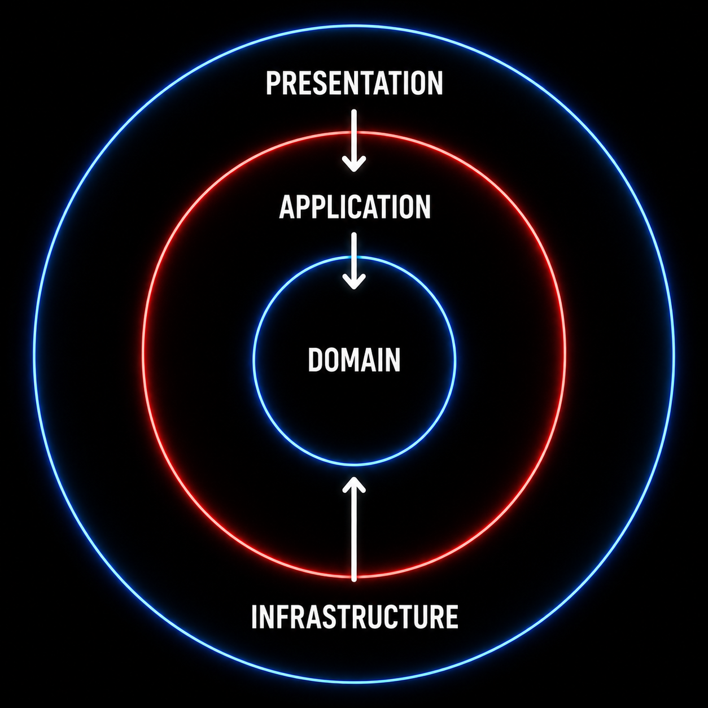

# Clean Architecture in Delphi
## Projeto minimalista

Projeto de exemplo: aplicação console simples em Delphi que demonstra o uso
de Arquitetura Limpa (Clean Architecture) com separação em camadas.

Descrição
--------
Aplicação console minimalista em Delphi que exemplifica a organização de um
projeto com Arquitetura Limpa. Entidades e interfaces estão em `domain/`,
casos de uso em `application/` e implementações de repositório em
`infrastructure/`.

Como executar
------------
- Abra `Project1.dproj` no Delphi e execute a aplicação (aplicação console).

Testes unitários
---------------

Este repositório inclui testes unitários de exemplo usando `DUnitX` na pasta
`tests/`.

Instruções rápidas:

- Instale o framework `DUnitX` no Delphi (GetIt ou pacote disponível para a
	sua versão do Delphi).
- Abra o projeto de testes `tests\TestRunner.dpr` no Delphi. Este runner
	registra e executa os testes presentes em `tests/`.
- Caso prefira criar um projeto novo: crie um projeto de testes (aplicação
	console ou projeto de teste DUnitX), adicione os arquivos da pasta `tests/`
	e ajuste o Search Path para incluir `domain;application;infrastructure`.
- Compile e execute o projeto de testes. Os resultados serão exibidos pelo
	DUnitX (Console ou GUI, conforme logger configurado).

Os testes incluídos verificam validações da entidade `TCliente` e operações de
`TClienteRepository`.